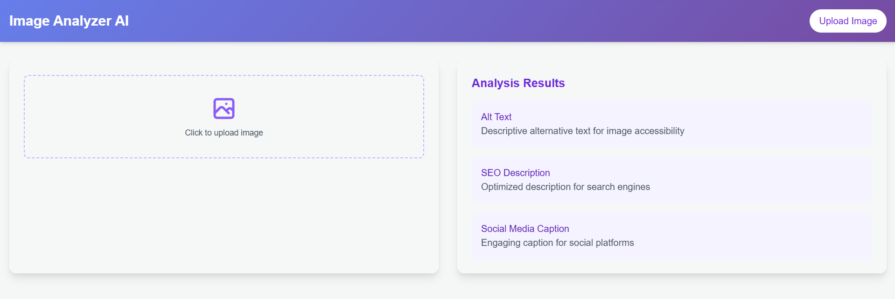

# Image Analyzer


A powerful Flask application that analyzes images using AI to generate alt text, context, SEO descriptions, and social media captions.

## Features

- Image analysis using BLIP model
- Alt text generation
- Context generation using GPT-3.5
- Enhanced captions using GPT-4
- SEO-optimized descriptions
- Social media caption generation
- Sentiment analysis
- Text-to-speech conversion

## Project Structure

```
.
├── README.md
├── requirements.txt
├── config/
│   └── config.py
├── app/
│   ├── __init__.py
│   ├── routes/
│   │   ├── __init__.py
│   │   └── main_routes.py
│   ├── services/
│   │   ├── __init__.py
│   │   ├── image_service.py
│   │   ├── text_service.py
│   │   └── seo_service.py
│   └── utils/
│       ├── __init__.py
│       └── file_utils.py
├── static/
├── templates/
└── run.py
```

## Prerequisites

- Python 3.8 or higher
- OpenAI API key
- NLTK data (for sentiment analysis)

## Installation

1. Clone the repository:
```bash
git clone <repository-url>
cd image-analyzer
```

2. Create a virtual environment and activate it:
```bash
python -m venv venv
source venv/bin/activate  # On Windows: venv\Scripts\activate
```

3. Install the required packages:
```bash
pip install -r requirements.txt
```

4. Download NLTK data:
```python
python -c "import nltk; nltk.download('vader_lexicon')"
```

5. Set up your OpenAI API key:
```bash
export OPENAI_API_KEY='your-api-key-here'
```

## Usage

1. Start the Flask application:
```bash
python run.py
```

2. Open your web browser and navigate to:
```
http://localhost:5000
```

3. Use the web interface to:
   - Upload images for analysis
   - Generate alt text and context
   - Create SEO descriptions
   - Generate social media captions
   - Convert text to speech

## API Endpoints

- `POST /analyze`: Analyze an image and get various descriptions
- `POST /text-to-speech`: Convert text to speech
- `GET /`: Landing page
- `GET /social-media`: Social media page
- `GET /seo`: SEO page
- `GET /general`: General analysis page

## Contributing

1. Fork the repository
2. Create your feature branch (`git checkout -b feature/amazing-feature`)
3. Commit your changes (`git commit -m 'Add some amazing feature'`)
4. Push to the branch (`git push origin feature/amazing-feature`)
5. Open a Pull Request

## License

MIT License

Copyright (c) 2024 Infosys Limited

Permission is hereby granted, free of charge, to any person obtaining a copy
of this software and associated documentation files (the "Software"), to deal
in the Software without restriction, including without limitation the rights
to use, copy, modify, merge, publish, distribute, sublicense, and/or sell
copies of the Software, and to permit persons to whom the Software is
furnished to do so, subject to the following conditions:

## Acknowledgments

- [BLIP](https://github.com/salesforce/BLIP) for image captioning
- [OpenAI](https://openai.com/) for GPT models
- [NLTK](https://www.nltk.org/) for sentiment analysis


